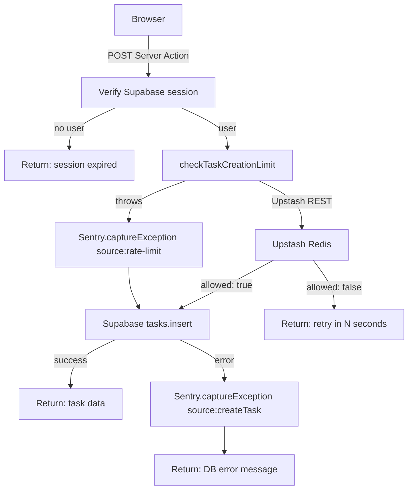

# Sentry and Redis Integration Design

## Overview

ScrollMinder uses two optional but production-critical services layered on top of its core Supabase/Next.js stack:

- **Sentry** (`@sentry/nextjs`) — full-stack observability: automatic error capture across the browser, Node.js server, and edge runtimes, plus Session Replay and distributed performance tracing.
- **Redis via Upstash** (`@upstash/redis` + `@upstash/ratelimit`) — serverless-compatible distributed rate limiting that protects the task-creation Server Action from abusive or runaway write traffic.

Both services are **opt-in**. The application starts and operates correctly without either one configured; they activate transparently when their environment variables are present.

---

## Why These Services Were Added

### The problems they solve

**Without observability (Sentry):** production failures in Server Actions, API routes, and cron jobs are invisible unless you manually tail Vercel logs. A Supabase insert error, a broken S3 presigned URL, or a silent cron failure would only surface when a user reports it — with no stack trace, no user context, and no history.

**Without rate limiting (Redis):** the `createTask` Server Action accepts authenticated requests and writes directly to Supabase. A compromised session, a client-side bug running a loop, or a simple rapid-fire UI interaction could flood the database with hundreds of rows in seconds. The Supabase free tier has row-count and request-rate limits, so uncontrolled writes carry real cost and data-quality risk.

Both services address **operational safety** at the infrastructure boundary — neither requires changes to UI components or business logic.

---

## Sentry Design

### SDK and package

```text
@sentry/nextjs ^10.62.0
```

The `@sentry/nextjs` package bundles separate SDKs for each Next.js runtime and automatically wires them through the webpack plugin at build time.

### Three runtime entry points

Next.js runs code in three distinct JavaScript environments, each with its own memory model. A single `Sentry.init()` call cannot cover all three, so three separate config files are loaded by the webpack plugin:

| File | Runtime | Additional config |
|---|---|---|
| `sentry.client.config.ts` | Browser | Session Replay, production trace sampling |
| `sentry.server.config.ts` | Node.js (Server Components, Server Actions, API routes) | Production trace sampling |
| `sentry.edge.config.ts` | Edge (Middleware, edge API routes) | Production trace sampling |

All three share the same DSN (`NEXT_PUBLIC_SENTRY_DSN`) and the same `debug: false` setting so the Sentry SDK never pollutes development console output.

### Build-time instrumentation via `withSentryConfig`

`next.config.ts` wraps the Next.js config with `withSentryConfig`, which applies three build-time effects:

**Source map upload** — Minified production bundles are source-mapped back to original TypeScript so that every stack trace in the Sentry dashboard shows the real file name, function name, and line number rather than a minified bundle reference. This requires `SENTRY_AUTH_TOKEN`, `SENTRY_ORG`, and `SENTRY_PROJECT` at build time, but the build succeeds without them (source maps are simply not uploaded).

**Automatic server function instrumentation** — `autoInstrumentServerFunctions: true` wraps every Next.js Server Component and server function at the webpack level. Unhandled errors thrown inside any of these are automatically caught and sent to Sentry without any manual try/catch.

**Client bundle tree-shaking** — `treeshake.removeDebugLogging: true` strips Sentry's own internal debug statements from the browser bundle, keeping the client payload small.

**Build verbosity** — `silent: !process.env.CI` suppresses plugin output outside of CI environments so local builds are not noisy.

### Performance tracing

`tracesSampleRate` is set to `0.2` in production across all three runtimes — 20% of requests generate a distributed trace — and to `0` in development to avoid trace noise during local development. The sampling decision is made per-request at the SDK level using the OpenTelemetry integration bundled inside `@sentry/node`.

### Session Replay

Configured only in `sentry.client.config.ts` via `Sentry.replayIntegration()`:

- **10%** of normal production sessions are recorded (`replaysSessionSampleRate: 0.1`)
- **100%** of sessions that contain an error are recorded (`replaysOnErrorSampleRate: 1.0`)

Session Replay captures DOM snapshots and user interactions, giving an exact reproduction of what a user did before an error occurred. The high error-session rate (100%) ensures that any crash is accompanied by a full replay; the low normal-session rate (10%) controls storage and data costs.

### Manual `captureException` calls

The SDK's automatic instrumentation catches unhandled errors. Manual captures are used for **handled errors** — cases where the code catches an exception and returns a graceful error to the user, but the infrastructure failure should still be visible in Sentry. Each call includes structured tags and context so events can be filtered and grouped in the dashboard:

| Location | Trigger | Sentry context |
|---|---|---|
| `app/actions/tasks.ts` | Rate-limit check throws (Upstash unreachable or misconfigured) | `tags: { source: "rate-limit" }` |
| `app/actions/tasks.ts` | Supabase insert fails in `createTask` | `tags: { source: "createTask" }`, `user: { id }` |
| `app/actions/tasks.ts` | Supabase delete fails in `deleteTask` | `tags: { source: "deleteTask" }`, `user: { id }`, `extra: { taskId }` |
| `app/actions/tasks.ts` | Supabase fetch fails in `fetchPendingTasks` | `tags: { source: "fetchPendingTasks" }`, `user: { id }` |
| `app/actions/attachments.ts` | S3 presigned upload URL generation fails | `tags: { source: "getPresignedUploadUrl" }` |
| `app/actions/attachments.ts` | S3 presigned download URL generation fails | `tags: { source: "getPresignedDownloadUrl" }` |
| `app/api/attachments/scan-callback/route.ts` | Supabase update fails after malware scan verdict | `tags: { source: "scan-callback" }`, `extra: { s3_key, task_id, verdict }` |
| `app/api/cron/due-reminders/route.ts` | Supabase fetch fails for a reminder window | `tags: { source: "cron:due-reminders", window: "3d"/"5d" }` |
| `app/api/cron/due-reminders/route.ts` | Resend email send fails for a specific task | `tags: { source: "cron:due-reminders:resend" }`, `extra: { taskId, userId }` |

The `source` tag is the primary grouping mechanism in the Sentry dashboard — it makes it immediately obvious which subsystem produced an alert without reading a full stack trace.

### What Sentry does not capture

Auth failures, validation rejections, and business-logic returns (rate limit exceeded, scan gate blocked) are returned to the client as structured errors and are **not** sent to Sentry. Only infrastructure failures — database errors, external API failures, cron system errors — are reported. This is intentional: Sentry should represent unexpected system failures, not expected user-facing error states.

---

## Redis Design

### Client library and transport

```text
@upstash/redis  ^1.38.0
@upstash/ratelimit  ^2.0.8
```

Upstash Redis is accessed over **HTTPS REST** rather than a TCP socket. This is a deliberate choice for a serverless deployment: Next.js Server Actions and API routes on Vercel run as Lambda functions with no persistent connections. A traditional Redis client (`ioredis`, `redis`) would open a TCP connection on every cold start and leave it dangling on function teardown. Upstash's REST API is stateless by design — each rate-limit check is a single HTTPS request, compatible with both Node.js and edge runtimes.

### Lazy singleton initialization

`lib/rate-limit/index.ts` exports a single public function, `checkTaskCreationLimit(userId)`. The underlying `Redis` client and `Ratelimit` instance are created inside a module-level `getLimiter()` function that caches the result in a `_limiter` variable:

```typescript
let _limiter: Ratelimit | null = null;

function getLimiter(): Ratelimit {
  if (_limiter) return _limiter;
  // read env vars, construct client, cache result
  _limiter = new Ratelimit({ ... });
  return _limiter;
}
```

The lazy pattern serves two purposes:

1. **Missing env vars surface clearly at call time**, not at module load. If `UPSTASH_REDIS_REST_URL` is absent, the error is thrown inside `checkTaskCreationLimit`, where it is caught by `createTask` and reported to Sentry — not as an unintelligible cold-start crash.
2. **The singleton avoids re-instantiating the client** on every call within the same function instance lifetime, reducing initialization overhead in warm invocations.

### Rate-limit algorithm

The limiter uses a **sliding window** algorithm:

```typescript
Ratelimit.slidingWindow(10, "10 s")
```

This allows **10 task-creation requests per authenticated user within any rolling 10-second window**. Sliding window (as opposed to fixed window) is chosen because it prevents bursting at window boundaries — a user cannot exhaust 10 slots at second 9, wait one second for a new fixed window, and immediately exhaust another 10 slots.

### Per-user keying and Redis key prefix

Every `limiter.limit(userId)` call stores its counters under a key scoped to both the application and the user:

```text
scrollminder:task-create:{userId}
```

The prefix `scrollminder:task-create` is set via the `prefix` option on `Ratelimit`. This means:

- All rate-limit keys are namespaced and easy to inspect in the Upstash dashboard
- The key space cannot collide with other potential future uses of the same Redis database
- Limits are enforced **per user**, so a high-volume user does not affect the quota of other users

### Analytics

`analytics: true` is passed to `Ratelimit`. This enables Upstash's built-in rate-limit analytics, which records request counts and limit-exceeded events in the Upstash dashboard without any additional instrumentation code.

### Return shape and retry hint

`checkTaskCreationLimit` returns a typed discriminated union:

```typescript
type RateLimitResult =
  | { allowed: true }
  | { allowed: false; retryAfterMs: number };
```

When the limit is exceeded, `reset - Date.now()` is computed to give the caller the exact number of milliseconds until the window clears. `createTask` converts this to whole seconds and includes it in the user-facing error message:

> "You're creating tasks too quickly. Please wait 3 seconds and try again."

This makes the rate limit transparent and actionable for the user rather than a generic rejection.

### Fail-open behavior

If `checkTaskCreationLimit` throws for any reason — network unreachable, misconfigured credentials, Upstash outage — `createTask` catches the exception, reports it to Sentry, and **allows the task creation to proceed**:

```typescript
try {
  const limit = await checkTaskCreationLimit(user.id);
  if (!limit.allowed) { ... }
} catch (err) {
  Sentry.captureException(err, { tags: { source: "rate-limit" } });
  // falls through — task creation continues
}
```

This is a deliberate product decision: rate limiting is a guardrail against abuse, not a security boundary. It is better for a legitimate user to create a task during an Upstash outage than to block all task creation because the rate-limit service is unavailable.

---

## Request Flow

The following diagram traces a single task creation request end to end:



---

## What They Provide Overall

### Sentry

**Production visibility without log archaeology.** Every infrastructure failure — a Supabase error, a broken S3 URL, a cron that silently fails to send email — arrives in the Sentry dashboard with a full stack trace, the user ID that triggered it, and the source tag that identifies the subsystem. Without Sentry, diagnosing these issues requires correlating Vercel function logs, which are ephemeral and unstructured.

**De-minified stack traces.** Source-map upload means that a stack trace from a production build points directly to the original TypeScript line, not to a minified bundle reference. This is the difference between "the error is somewhere in chunk-abc123.js" and "the error is at `app/actions/tasks.ts:70`."

**Session Replay for client errors.** The 100% replay rate on error sessions means that any client-side crash is accompanied by a video-like reconstruction of what the user did. This eliminates the "I can't reproduce it" problem for UI bugs.

**Performance baseline.** The 20% production trace sample rate gives a statistical view of p50/p95 latency across server functions and API routes without requiring instrumentation code in the application.

**Test isolation.** Sentry is mocked in unit tests (`vi.mock("@sentry/nextjs", ...)`) so no events are sent during test runs, keeping tests fast and the Sentry project clean.

### Redis

**Database protection.** Supabase has connection and request limits on free and lower-tier plans. A user creating 50 tasks in two seconds — whether through a client bug, automation, or intentional abuse — would exhaust write capacity and potentially cause errors for other users. The sliding-window limiter prevents this class of write amplification before it reaches the database layer.

**User transparency.** The `retryAfterMs` value surfaced in the error message gives users an actionable recovery path rather than an opaque "something went wrong" message.

**Zero operational overhead.** Upstash is serverless and managed. There is no Redis instance to provision, patch, or scale. The REST API works identically in local development (with real Upstash credentials), in CI (bypassed via empty env vars), and in production.

**Resilience.** Fail-open design means a Redis outage degrades gracefully to an unthrottled but still functional state, with the outage reported to Sentry. No user is blocked from creating tasks because the rate-limit service is unavailable.

---

## Operational Notes

### Environment variables

| Variable | Required | Effect when absent |
|---|---|---|
| `NEXT_PUBLIC_SENTRY_DSN` | No | All Sentry capture calls are no-ops; no events are sent |
| `SENTRY_AUTH_TOKEN` | No (build only) | Source maps are not uploaded; build still succeeds |
| `SENTRY_ORG` | No (build only) | Required alongside `SENTRY_AUTH_TOKEN` for upload |
| `SENTRY_PROJECT` | No (build only) | Required alongside `SENTRY_AUTH_TOKEN` for upload |
| `UPSTASH_REDIS_REST_URL` | No | `checkTaskCreationLimit` throws; `createTask` logs to Sentry and proceeds |
| `UPSTASH_REDIS_REST_TOKEN` | No | Same as above |

### Local development

Both services can be used in local development with real credentials in `.env.local`. For most development work, leaving both sets of env vars unset is sufficient — errors will be logged to the terminal rather than Sentry, and rate limiting will be bypassed silently.

### CI behavior

The GitHub Actions workflow at `.github/workflows/ci.yml` sets `NEXT_PUBLIC_SENTRY_DSN: ""` (disabling Sentry capture during test runs) and both Upstash vars to empty strings (bypassing rate limiting in tests). `SENTRY_AUTH_TOKEN` is passed from a repository secret so source-map upload can run if the secret is configured, but this is optional.

### What Redis does not store

Redis holds only the sliding-window counters for task-creation rate limiting, keyed by user ID. It does not store session data, attachment scan state, task content, or any user PII. All application state lives in Supabase.

---

## Tradeoffs and Future Improvements

### Current scope boundaries

**No custom Sentry error pages.** Next.js `app/error.tsx` and `app/global-error.tsx` are not wired to Sentry. Unhandled React rendering errors bubble to the default Next.js error UI. Adding `Sentry.captureException` in an `error.tsx` boundary would improve client-error visibility.

**No global user context.** `Sentry.setUser()` is not called after authentication, so most captured events do not have a user automatically attached. User IDs are instead passed explicitly on each `captureException` call for server-side failures. A global user context set in `app/layout.tsx` (client component) would enrich all client-side events automatically.

**Redis scope is limited to task creation.** Only `createTask` is rate limited. Other write operations (`deleteTask`, attachment uploads) are not currently protected. Extending rate limiting to attachment uploads is a potential future improvement.

**No custom Sentry spans.** Performance tracing relies entirely on SDK auto-instrumentation. Adding manual `Sentry.startSpan()` calls around Supabase queries and S3 operations would produce more granular latency breakdowns in the Sentry performance dashboard.

### Potential improvements

- Add `app/global-error.tsx` with `Sentry.captureException` to catch unhandled client render errors.
- Call `Sentry.setUser({ id: user.id })` in a client-side effect after authentication for richer event context.
- Extend rate limiting to attachment upload and download Server Actions.
- Add custom spans around Supabase and S3 calls for per-operation performance visibility.
- Consider a higher `tracesSampleRate` (e.g. `1.0`) during an initial production burn-in period to capture a full performance baseline before reducing to 20%.
